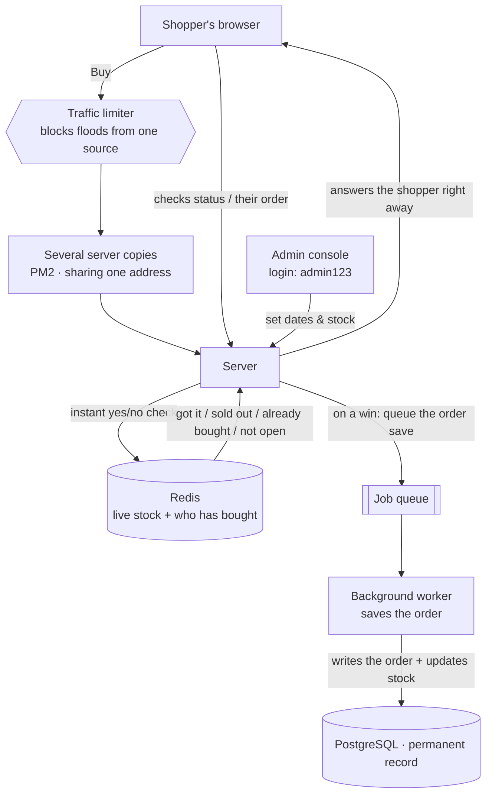

# Flash Sale System

A small web app for running a **flash sale** — one limited-stock product, sold for a limited
time, to a crowd that all shows up at once (think a sneaker drop or concert tickets).

The whole challenge is staying correct when thousands of people click "Buy" in the same
second. Three rules can never break:

1. **Never oversell** — if there are 100 items, at most 100 people can win. Never 101.
2. **One per person** — the same user can't grab two.
3. **Only during the sale** — buying works only while the sale is live, not before or after.

Everything below is built around keeping those three promises under heavy load.

**Built with:** NestJS + Fastify (server) · React + Vite (web app) · Redis and PostgreSQL
(data) · PM2 (to run several copies of the server at once).

## How it works

When someone taps **Buy**, the server asks **Redis** to make the decision. In one quick step,
Redis checks three things together — has this person already bought, are there items left, and
is the sale open — and answers immediately: *got it*, *sold out*, *already bought*, or *not
open*. Redis handles one request at a time, so even during a rush two people can't both claim
the last item.

If the answer is *got it*, the win is recorded right away and the shopper is told instantly.
Writing the order into the permanent database (**PostgreSQL**) happens a moment later, in the
background, so the database is never the bottleneck during a spike.

Deciding instantly in Redis and saving to the database afterward is the core idea — it keeps
the site fast and correct even when a large crowd buys at the same time.



## Design choices & trade-offs

Every choice here buys something and costs something — here's the honest ledger:

| What we chose | Why it helps | The trade-off |
|---|---|---|
| **Let Redis make the buy decision** | Redis handles one request at a time, so two shoppers can't win the same last item — and it's very fast. | Redis becomes essential, so it needs backups/replicas so it can't be a single point of failure. |
| **Answer the shopper instantly, save to the database in the background** | The shopper sees "You got it!" right away, and the database isn't overwhelmed during the rush. | There's a brief moment where an order is *reserved* but not yet *confirmed* in the database. We show both states honestly, so it's never misleading. |
| **Prevent overselling in three separate places** | Even if Redis went down mid-sale, the database still refuses to sell the same item twice or drop below zero. | A little bit of the same rule is enforced in more than one place. |
| **Run several server copies at once** (PM2) | Proves the design can scale out to handle more traffic — more copies, more throughput. | On one laptop it's a simulation of many servers, not a real multi-machine setup. But the code is identical to a real deployment. |
| **Admin login is just the username `admin123`** | Keeps the demo dead simple — no passwords or tokens to set up. | This is **not real security** — anyone could be admin. Fine for a demo; a real app would add proper login and roles. |

## What you'll need

- **Node.js 20+** and npm
- **Docker** (used to run Redis and PostgreSQL — no manual install needed)

## Run it

Three steps: start the databases, start the server, start the web app.

```bash
# 1. Start Redis + PostgreSQL (via Docker)
docker compose up -d

# 2. Start the server
cd backend
cp .env.example .env
npm install
npx prisma migrate dev      # set up the database tables
npm run seed                # create a product + an active sale to buy from
npm run start:dev           # server runs at http://localhost:3000

# 3. Start the web app (in a second terminal)
cd frontend
npm install
npm run dev                 # web app at http://localhost:5173
```

Then open **http://localhost:5173**.

## Try it

- **Log in** with any name (e.g. `alice`) — no password needed.
- **Buy Now** — grab the item. You'll see whether you got it, already had one, or it sold out.
- **My Order** — watch your order go from *reserved* to *confirmed*.
- **Admin** — log in as **`admin123`** instead to open the admin console, where you can set
  the sale's start/end time and how much stock is available.

## The web app

A simple React app with a login screen and three tabs for a shopper:

- **Sale** — is the sale upcoming, live, or over, and how many items are left (with a
  countdown and a progress bar).
- **Buy Now** — one button to buy; the button is disabled unless the sale is live.
- **My Order** — shows your status: nothing yet, reserved, or confirmed.

Logging in as `admin123` swaps the tabs for an **admin console** to configure the sale.

## Running the tests

```bash
cd backend
npm test                 # runs the full test suite (needs Docker running)
```

There are **22 tests** covering the buy logic, the sale timing, the full request flow, and —
most importantly — proofs that the system never oversells even when 300–1,000 buyers hit it
at the exact same moment. To run just one:

```bash
npx jest reservation     # one test file
npx jest sale -t "sold"  # one test by name
```

## Stress test (the real proof)

This is where we prove the three rules hold under a genuine stampede. It starts **4 copies of
the server** and throws thousands of simultaneous buyers at them.

```bash
cd backend
npm run build
npm run seed                 # one clean sale
npm run pm2:start            # start 4 server copies   (npm run pm2:stop to shut them down)
npm run stress               # simulate the rush
```

You can crank up the numbers:

```bash
STRESS_STOCK=2000 STRESS_BUYERS=12000 STRESS_CONCURRENCY=200 npm run stress
```

The stress tool fires thousands of buyers (including repeat buyers trying to grab two), waits
for everything to settle, then checks the results against Redis and the database directly. It
fails loudly if any of the three rules were broken.

**What you should see** — with 2,000 items and 12,000 buyers:

```
13,000 requests handled in ~6 seconds (across 4 server copies)
got it = 2000   already bought = 525   sold out = 10475   errors = 0

=== all checks passed ===
  winners == stock            (2000 / 2000)   ← exactly 2000, never 2001
  items left == 0
  saved orders == stock       (2000)
  no one bought twice         (2000 orders, 2000 distinct users)
  a repeat buyer was rejected
  a late buyer got "sold out"
```

**In plain terms:** 12,000 people rushed 2,000 items and *exactly* 2,000 got one — not a
single item oversold, and nobody won twice — even with four server copies running at once.

> Why does running multiple copies stay correct? Because the servers don't keep any private
> count in their own memory — they all ask the same Redis. That's the entire reason this
> design scales.

## Project layout

```
backend/     the server (NestJS)
  src/
    reservation/   the fast "can this person buy?" decision (Redis)
    fulfillment/   the background worker that saves orders
    sale/          sale status, timing, and buying
    admin/         admin endpoints to configure the sale
    rate-limit/    flood protection
    health/        a simple "is everything up?" check
    seed.ts        resets to one fresh sale
    stress.ts      the stress test tool
frontend/    the React web app
docker-compose.yml   Redis + PostgreSQL
```
